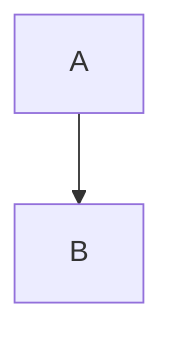
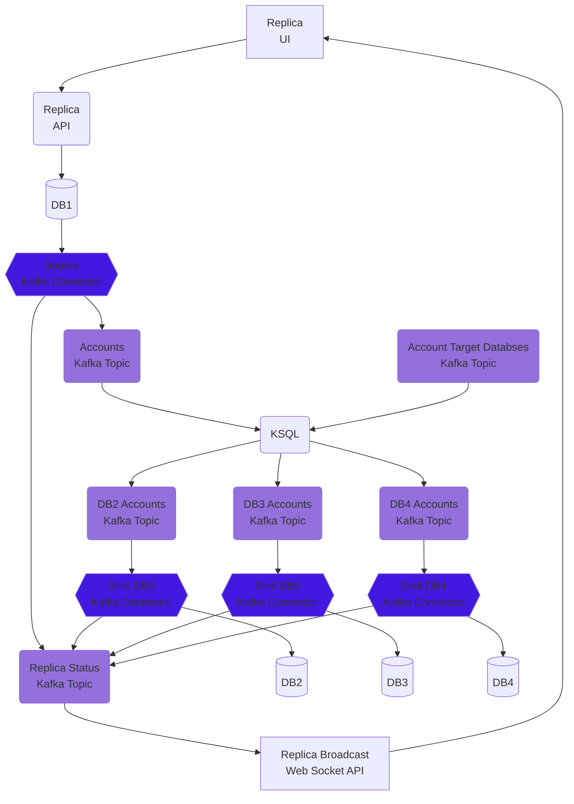

```mermaid
flowchart TD
    A-->B;
```

```mermaid
flowchart
    RUI[Replica\nUI]
    RAPI(Replica\nAPI)
    RB[Replica Broadcast\nWeb Socket API]
    KTA(Accounts\nKafka Topic)
    KTT(Account Target Databses\nKafka Topic)
    KSQL(KSQL)
    KTDB2(DB2 Accounts\nKafka Topic)
    KTDB3(DB3 Accounts\nKafka Topic)
    KTDB4(DB4 Accounts\nKafka Topic)
    KTS(Replica Status\nKafka Topic)
    KSC{{Source\nKafka Connector}}
    KSC2{{Sink DB2\nKafka Connector}}
    KSC3{{Sink DB3\nKafka Connector}}
    KSC4{{Sink DB4\nKafka Connector}}
    DB1[(DB1)]
    DB2[(DB2)]
    DB3[(DB3)]
    DB4[(DB4)]

    style KTA fill:#9370DB
    style KTT fill:#9370DB
    style KTDB2 fill:#9370DB
    style KTDB3 fill:#9370DB
    style KTDB4 fill:#9370DB
    style KTS fill:#9370DB
    style KSC fill:#4319DF
    style KSC2 fill:#4319DF
    style KSC3 fill:#4319DF
    style KSC4 fill:#4319DF

    RUI-->RAPI-->DB1-->KSC
    KSC-->KTA
    KSC-->KTS
    KTA-->KSQL
    KTT-->KSQL
    KSQL-->KTDB2 & KTDB3 & KTDB4
    KTDB2-->KSC2
    KTDB3-->KSC3
    KTDB4-->KSC4
    KSC2-->DB2
    KSC3-->DB3
    KSC4-->DB4
    KSC2 & KSC3 & KSC4-->KTS
    KTS-->RB
    RB-->RUI
```